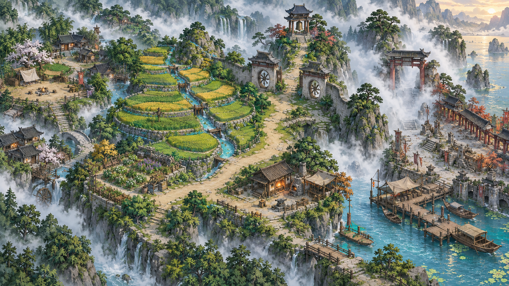

# 观气行旅：雾隐渡



一款把传统形势观察与四柱关系转译成空间谜题的中文叙事探索 Demo。玩家以越肩视角进入雾村，先看环境发生了什么，再通过移动屏风、稳定灯火、照出桥痕和启动桥台理解因果；术语只在操作之后出现，不要求玩家先背规则。

这不是现实风水或命运预测工具。命盘用于虚构角色构筑、法式消耗和人物协作；所有传统文本均按历史文化材料处理。

## 可玩内容

- 原创低多边形 3D 越肩场景，可拖动镜头，并可切换原创 2D 总览地图。
- 六步无门槛第一关教学：看风、转屏、稳灯、照桥、开路、亲自过桥。
- 错误摆法有现场反馈和立即撤回，不扣资源，不靠试错惩罚玩家。
- 开场、雾村、旧渠、药圃、渡口和结尾剧情对白。
- 水路、风路、识路三条环境主线，以及可选峡谷近路。
- 随机、模板、部分锁定和分享码四种虚构角色命盘创建方式。
- 四柱面板展示十神、干支、藏干、纳音、地势、空亡与神煞，并明确展示解释边界。
- 15 个五行法式、4 位有自己作息的 NPC、0 至 2 人自由同行、6 组神煞支线。
- 双代际本地存档、校验和、导入导出和旧版迁移。

## 立即试玩

项目不需要安装依赖。进入游戏目录后启动任意静态服务器：

```bash
cd guanqi-game
python3 -m http.server 4173 --bind 127.0.0.1
```

浏览器打开 `http://127.0.0.1:4173/`。

操作：方向键或 `WASD` 移动，`E` 互动，`Q` 开关观局。触屏端提供方向键、观局和行动按钮。

## 第一关设计

教学先让玩家看见问题，再给问题命名：

1. 比较灯焰和布条，辨认来风。
2. 选择屏风摆法，同时满足“风绕开灯”和“照桥光路不断”。
3. 点灯验证，不用文字替代结果。
4. 用景门把稳定光线照向雾中桥痕。
5. 用开门启动已经看清的旧桥台。
6. 玩家亲自走过桥，才进入正式送信任务。

场景左上角持续显示当前关系检查；顶部因果条记录“看风 → 转屏 → 稳灯 → 照桥 → 开路”。屏风、灯、桥是本作的教学转译，不冒称古籍记载的固定风水局。

## 研究基础

本仓库保留可复核的公版影印本、页码和逐句校读记录：

- 《郭璞葬经》合刊本：62 页逐页检查，正文 155 条校读。
- 《子平真诠》：前七篇 PDF 10-25，43 个句群逐页校读。
- 《滴天髓阐微》：已完成版本和目录定位，尚未声称通读。

《子平真诠》校读特别记录“万物/万木”“日干/十干”“官星反轻/反清”“六阳六阴/五阳五阴”等会改变规则的底本异文。详细进度见 [`research/close-reading/README.md`](research/close-reading/README.md)，游戏转译原则见 [`research/READING_NOTES.md`](research/READING_NOTES.md)。

## 验证

```bash
node guanqi-game/selfcheck.cjs
python3 tools/validate_handoff.py
```

当前结果：

- 游戏自检通过，覆盖命盘生成、导入导出、预算、十神方向、命盘表、两阶段指引、15 法式接线、资源存在和旧存档迁移。
- 设计数据校验通过，解析 27 个 JSON 文件并检查 66 项验收定义。
- 真实浏览器完整走通第一关错误摆法、恢复、点灯、照桥、开路和过桥流程。
- 1280×720 与 390×844 均通过 3D 画布像素检查：25 个采样点全部非透明，16 种采样色；控制台无错误或警告。

自动化不能证明游戏有趣。陌生玩家能否复述规则并迁移到新谜题，仍需要正式试玩研究。

## 项目结构

- `guanqi-game/`：可直接运行和部署的静态浏览器游戏。
- `research/`：公版影印本、来源记录与逐句校读台账。
- `data/`：角色、地图、技能、NPC、神煞和事件的权威数据。
- `contracts/`、`schemas/`：类型与数据边界。
- `docs/IMPLEMENTATION_STATUS.md`：实现范围、真实检查和已知边界。
- `GAME_SPEC.md`、`PLAYER_EXPERIENCE.md`：完整产品与体验设计。

## 素材与边界

地图和人物头像为本项目原创 AI 生成素材，没有使用商业游戏地图、角色、Logo 或字体。Three.js 0.186.0 以 MIT License 随仓库保存；完整台账见 [`guanqi-game/assets/ASSET_LICENSES.md`](guanqi-game/assets/ASSET_LICENSES.md)。

当前 Demo 是单人原型，不宣称已实现真人联机；角色仍使用简化低多边形几何体，重点是镜头、空间、剧情和任务可读性。

